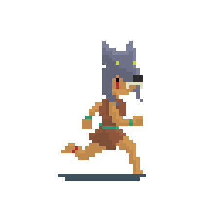

  <h1>💫 About Me:</h1> 

  🎮 Passionate game developer with a love for creating immersive and engaging experiences. 
  💻 Currently working on projects like a two-player strategy game and a dungeon-crawling shooter. 
  📱 Exploring mobile game    development and always eager to learn new technologies. 
  🚀 Open to collaboration and exciting opportunities in the gaming industry.

 

  <h1>💻 Tech Stack:</h1> 
  
  
  
  
  

 

  <h1>🌐 Socials:</h1>
  
  

 
 

  <picture>
    <source media="(prefers-color-scheme: dark)" srcset="https://raw.githubusercontent.com/tobiasmeyhoefer/tobiasmeyhoefer/output/github-snake-dark.svg" />
    <source media="(prefers-color-scheme: light)" srcset="https://raw.githubusercontent.com/tobiasmeyhoefer/tobiasmeyhoefer/output/github-snake.svg" />
    
  </picture>

 

  <h1>🌐 Itch.io Links:</h1>
  
  
  

 

  <h1>📊 GitHub Stats:</h1> 
  
  

 
 

  <h1></h1>
  

